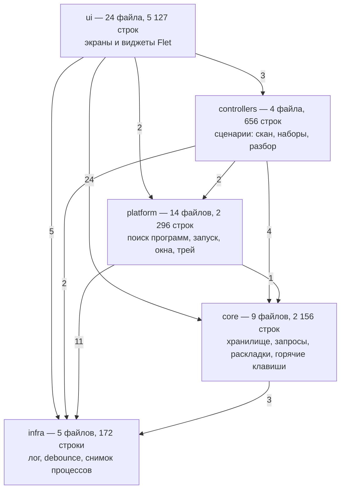

# Аттестация проекта Centurio — структурный анализ

**Дата:** 26 августа 2026
**Ревизия:** `72d8bf1` (ветка `claude/project-analysis-f0x96y`)
**Предмет аттестации:** структура кода — деление на модули и слои, связность,
сцепление, сложность, проверяемость. Поведение и безопасность разбирались
отдельно, в `AUDIT.md` от 14 августа; здесь они упоминаются, только когда
следуют из структуры.

---

## 1. Вердикт

| Что оценивалось | Оценка | Одной строкой |
|-----------------|--------|---------------|
| Деление на слои | **отлично** | 5 слоёв, направление зависимостей проверяется тестом |
| Гранулярность модулей | **хорошо** | медиана 154 строки, но один файл на 1 151 |
| Сцепление (coupling) | **требует работы** | 147 обращений к чужим приватным полям, `ui` как общая шина |
| Связность (cohesion) | **удовлетворительно** | `CenturioUI` и `Store` совмещают по 3–4 роли |
| Сложность | **хорошо** | медиана функции 7 строк, средняя цикломатика 3,8 |
| Типизация домена | **требует работы** | 0 dataclass/TypedDict, весь домен — голые `dict` |
| Проверяемость | **хорошо** | 100 тестов, 73 % покрытия, 4 фитнес-функции архитектуры |
| Структура тестов | **удовлетворительно** | 96 тестов в одном файле на 4 958 строк |
| Документированность кода | **требует работы** | 29 docstring на 812 определений (3,6 %) |
| Модель параллелизма | **удовлетворительно** | 9 точек запуска потоков, 13 замков, единого владельца нет |
| Сборка и CI | **отлично** | матрица 2 ОС × 2 версии Python, версия сверяется в трёх файлах |
| Дублирование | **отлично** | 14 повторов по 6 строк, два реальных очага |

**Итог: проект аттестован.** Фундамент здоровый: слои разделены и это
удерживается автоматически, модули мелкие, дублирования почти нет, поставка
собирается и проверяется. Структурный долг сосредоточен в двух местах —
объект-бог `CenturioUI` и нетипизированная доменная модель, — и оба чинятся
поэтапно, без переписывания.

---

## 2. Замеренные показатели

Всё ниже получено прогоном на ревизии `72d8bf1`, Python 3.11.15, Linux.

### 2.1 Объём

| Показатель | Значение |
|------------|----------|
| Файлов Python в `app/` | 59 (54 с кодом, 5 пустых `__init__.py`) |
| Строк кода приложения | 10 953 (`app/` — 10 927, `main.py` — 26) |
| Строк тестов | 5 143 |
| Классов | 25 |
| Функций и методов | 787 |
| Медиана размера файла | 154 строки |
| Файлов длиннее 400 строк | 6 |

### 2.2 Качество прогона

| Проверка | Результат |
|----------|-----------|
| `python -m ruff check .` | 0 замечаний |
| `python -m pytest -q` | 100 тестов, все зелёные |
| Покрытие `app/` | 73 % (7 046 инструкций, 1 911 не покрыто) |
| Циклы импортов | нет |
| Недостижимые модули | нет (проверяется `test_every_module_is_reachable`) |
| `TODO` / `FIXME` | 0 |
| Голых `except:` | 0 (85 `except Exception`, 4 из них с `pass`) |

### 2.3 Распределение по слоям

| Слой | Файлов | Строк | Функций | Docstring | Аннотаций возврата | Аннотаций аргументов |
|------|-------:|------:|--------:|----------:|-------------------:|---------------------:|
| `ui` | 24 | 5 127 | 389 | 1 % | 16 % | 17 % |
| `platform` | 14 | 2 296 | 119 | 10 % | 75 % | 76 % |
| `core` | 9 | 2 156 | 170 | 4 % | 71 % | 65 % |
| `controllers` | 4 | 656 | 62 | 1 % | 6 % | 7 % |
| корень (`main`, `diagnose`) | 3 | 520 | 31 | 0 % | 6 % | 20 % |
| `infra` | 5 | 172 | 16 | 6 % | 56 % | 50 % |

Разрыв говорит сам за себя: `core` и `platform` написаны как библиотеки — с
типами и описаниями; `ui` и `controllers` — как скрипт, который держится на
том, что автор помнит форму данных.

### 2.4 Крупнейшие единицы

| Файл | Строк | Крупнейший класс | Методов | Полей |
|------|------:|------------------|--------:|------:|
| `app/ui/app.py` | 1 151 | `CenturioUI` | 132 | 62 |
| `app/core/store/store.py` | 765 | `Store` | 53 | 8 |
| `app/ui/grid.py` | 482 | `GridView` | 29 | 4 |
| `app/platform/discovery/windows.py` | 468 | — | — | — |
| `app/main.py` | 414 | — (функция `main` на 320 строк) | — | — |
| `app/ui/chrome.py` | 413 | `Chrome` | 18 | 1 |

### 2.5 Сложность

| Показатель | Значение |
|------------|----------|
| Медиана длины функции | 7 строк |
| Средняя цикломатическая сложность | 3,8 |
| Функций длиннее 60 строк | 9 |
| Функций со сложностью > 12 | 31 |
| Функций с более чем 6 параметрами | 13 |
| Самая сложная функция | `app/main.py:55 main` — 320 строк, CC = 70 |

---

## 3. Структура: как она устроена

### 3.1 Слои



Ранги из `tests/test_imports.py`: `infra` = 0, `core` = `platform` = 1,
`controllers` = 2, `ui` = 3. Импорт наружу — в слой с большим рангом —
роняет тест. Ни одного нарушения на текущей ревизии нет.

**Это сильная сторона проекта.** Четыре фитнес-функции в
`tests/test_imports.py` держат структуру автоматически:

| Тест | Что ловит |
|------|-----------|
| `test_internal_imports_resolve` | импорт несуществующего модуля или имени, включая отложенные внутри функций |
| `test_no_module_shadowed_by_package` | `app/x.py` рядом с `app/x/` — файл, который никогда не выполнится |
| `test_every_module_is_reachable` | модуль, до которого не дотягивается ни точка входа, ни тест |
| `test_layers_do_not_depend_outwards` | импорт слоя наружу |

Такое в проектах этого размера встречается редко и стоит сохранить при любых
перестройках.

### 3.2 Граница данных

`app/core/store/sanitize.py` — отдельный слой очистки: 265 строк чистых
функций `clean_app`, `clean_category`, `clean_set`, `clean_inbox`,
`clean_settings`, через которые проходит всё прочитанное с диска **и** всё
записываемое. Схема, значения по умолчанию и допустимые типы настроек лежат
в одном месте. Это правильно построенный антикоррупционный слой, и он
объясняет, почему битый файл данных не роняет программу.

### 3.3 Модель отрисовки

`CenturioUI.refresh()` (`app/ui/app.py:253`) пересобирает дерево контролов
целиком: заново строятся шапка, рельса, боковая панель, содержимое,
инспектор. Это отрисовка в стиле immediate-mode поверх retained-mode
библиотеки, и она тянет за собой цепочку компенсаций:

- кэш плиток `_tile_cache` на 600 записей с ключом-эпохой `_tile_epoch`
  (`app/ui/app.py:266`) — иначе пересборка сетки на каждый чих;
- `PERSISTENT_FIELDS` в `app/core/view_state.py:15` — три поля ввода
  создаются один раз и переживают пересборку, остальные теряют фокус;
- `view.typing` — признак «курсор в поле ввода», без которого глобальный
  `page.on_keyboard_event` удалял программу по `Delete`, набранному в поле
  аргументов;
- снимок состояния в `threading.local` (`app/ui/app.py:133`), чтобы фоновый
  поток не читал наполовину перестроенное дерево.

Выбор рабочий и обоснованный, компенсации на месте и покрыты тестами. Но
цена зафиксирована: каждая новая интерактивная область требует ручного
решения «переживает пересборку или нет».

---

## 4. Структурные находки

Ранжированы по стоимости изменения, а не по симптому.

### С-1. `CenturioUI` — объект-бог и общая шина. Критично

`app/ui/app.py:37`. 1 112 строк, 132 метода (50 публичных, 82 приватных),
62 поля, из них 58 присваиваются в `__init__`.

Класс совмещает четыре роли: точка сборки интерфейса, хранилище изменяемого
состояния, набор обработчиков действий и фасад над `Store`. Восемь
сотрудников (`Chrome`, `GridView`, `InspectorPanel`, `Keymap`,
`ContextMenus`, `SetsController`, `ScanController`, `TriageController`)
принимают его целиком единственным аргументом конструктора и держат обратную
ссылку.

Последствие измеримо: **147 обращений к приватным членам `CenturioUI` из
других модулей** (93 разных пары «модуль → член»).

| Файл | Обращений | Разных членов |
|------|----------:|--------------:|
| `app/ui/grid.py` | 40 | 16 |
| `app/ui/chrome.py` | 25 | 17 |
| `app/ui/context_menus.py` | 23 | 17 |
| `app/ui/screens/*.py` | 20 | 14 |
| `app/ui/inspector.py` | 19 | 15 |
| `app/ui/keymap.py` | 17 | 13 |
| `app/main.py` | 2 | 1 (`ui._launch`, строки 211 и 279) |
| **Итого вне `app/ui/app.py`** | **147** | **93** |

Приватный интерфейс `CenturioUI` фактически публичный: подчёркивание не
несёт информации, а любое переименование внутреннего метода тихо ломает до
тринадцати модулей — статически это не ловится ничем, потому что `ui`
нетипизирован.

Обратное направление тоже есть: `GridView` пишет в приватное поле хозяина —
`self.ui._sel_id = self.ui._selected_id(sections)` (`app/ui/grid.py:55`).
Кэш выбранной плитки живёт в `CenturioUI`, а вычисляет и обновляет его
сотрудник.

### С-2. Слой `controllers` связан с интерфейсом в рантайме. Критично

Тест слоёв смотрит на импорты — и он честно зелёный: `app/controllers/*` не
импортирует `app.ui`. Но зависимость приходит через конструктор:

```python
class SetsController:
    def __init__(self, ui):
        self.ui = ui                 # app/controllers/sets.py:15
```

Обращений к `ui.*` из контроллеров — 113, в том числе:

| Обращение | Раз | Что это по сути |
|-----------|----:|-----------------|
| `ui.view` | 33 | состояние представления |
| `ui.refresh` / `ui.safe_refresh` | 33 | команда перерисовки |
| `ui.on_library_changed` | 15 | обратный вызов |
| `ui.search_field` | 1 | **виджет Flet напрямую** |

`app/controllers/sets.py:26` делает `self.ui.search_field.value = ""` —
контроллер правит текстовое поле интерфейса. Плюс контроллеры целиком
отвечают за формулировки тостов: 70 русских строк вида
`'Ни одно окно набора не открыто'`.

Значит фитнес-функция измеряет направление импортов, а не направление
зависимостей: настоящая связь идёт через нетипизированную ручку и для теста
невидима. Слой `controllers` без интерфейса не собирается и в изоляции не
тестируется — покрытие `app/controllers/sets.py` = 43 %, самое низкое среди
непплатформенных модулей.

### С-3. Домен — голые `dict`. Существенно

Во всём приложении **ни одного** `dataclass`, `TypedDict`, `NamedTuple` или
`Protocol`. Программа, категория, набор, элемент набора, запись разбора —
всё это `dict[str, Any]`, кочующий через все пять слоёв:

```python
def add_app(self, app: dict) -> dict:          # app/core/store/store.py:230
def get_app(self, app_id: str) -> dict | None: # app/core/store/store.py:252
```

Форма записи существует в трёх местах и ни одно не является определением:
`sanitize.clean_app` знает её в рантайме, тесты — на примерах, разработчик —
по памяти. Аннотации аргументов покрывают 36 % параметров, в `ui` и
`controllers` — 17 % и 7 %.

Практический эффект: опечатка в ключе (`app["hotkey"]` против
`app["accel"]`) не ловится ни линтером, ни типами — только тестом, если он
на этот путь есть. Это же объясняет, почему тестов написано так много: они
заменяют собой систему типов.

### С-4. `main()` — точка сборки на 320 строк. Существенно

`app/main.py:55`. Цикломатическая сложность 70, около двадцати вложенных
замыканий (`quit_app`, `apply_window`, `set_visible`, `show_window`,
`hide_window`, `open_library`, `toggle_launch`, `minimize`,
`toggle_maximize`, `close`, `hide_to_tray`, `on_setting`, `on_hotkey`,
`refresh_runtime`, `tray_menu`, `on_key`, `_flush_geometry`, `save_window`,
`on_win_event`, `_backfill`, `_auto_rescan_loop`), связанных общим
изменяемым словарём `ui_holder` и `nonlocal last_rejected`.

Здесь собрано всё сразу: тема окна, режим web, геометрия, реестр горячих
клавиш, трей, автозапуск, дозаполнение значков, фоновое пересканирование.
Ни одно из этого не адресуемо по имени снаружи, поэтому покрытие файла —
**12 %**, самое низкое в проекте после `diagnose.py`. Функция `shutdown()`,
которую специально вынесли наверх, покрыта тестом
(`test_shutdown_releases_resources`) — это показывает и способ лечения:
вынести остальные обязанности в именованные объекты.

### С-5. Состояние разложено по двум местам. Существенно

`ViewState` (`app/core/view_state.py`, 28 полей, 37 методов) — аккуратная,
не зависящая от Flet модель состояния представления. `CenturioUI` — ещё 58
полей. Правила, что где лежит, нет:

| Что | Где лежит |
|-----|-----------|
| индекс выделения, множественный выбор, режим, сортировка, фильтр | `ViewState` |
| id выделенной плитки (`_sel_id`) | `CenturioUI` (кэш от `ViewState`) |
| открытый инспектор | `ViewState.inspector` |
| поля экрана «Добавить» (`_add_ui`) | `CenturioUI` |
| снимок окон, размер значка, эпоха плиток | `CenturioUI` |

`_selected_id()` выводит значение из `view.inspector` и `view.selected`, а
`_sel_id` его кэширует — два источника правды для одного факта.

Отдельно: `ViewState` живёт в `core`, хотя это состояние представления.
Формально ранги позволяют, по смыслу — слой не тот.

### С-6. Пользовательский текст размазан по всем слоям. Существенно

Русские строки, не являющиеся сообщениями лога:

| Слой | Строк |
|------|------:|
| `ui` | 317 |
| `core` | 108 |
| `controllers` | 70 |
| `platform` | 28 |
| `diagnose.py` | 26 |

Каталога сообщений нет. В `core/queries.py` лежат подписи интерфейса
(`SORT_LABELS`, ярлыки в `SOURCES`) — это уже представление в доменном слое.
Плюрализация (`plu_apps`, `plu_programs`, `plu_windows` в `core/text.py`)
захардкожена под русскую морфологию тремя формами. Локализация в текущем
виде означает правку 549 мест.

### С-7. Приватные связи между соседями в `platform/discovery`. Умеренно

Десять обращений между братскими модулями пакета:

```
app/platform/discovery/icons.py:16     windows._win_extract_one
app/platform/discovery/icons.py:27     steam_paths._steam_roots
app/platform/discovery/icons.py:28     steam_art._steam_icon
app/platform/discovery/icons.py:74     steam_paths._steam_exe_cache_path
app/platform/discovery/epic.py:44      windows._win_extract_one
app/platform/discovery/steam_paths.py:225  windows._win_extract_one
app/platform/discovery/steam_paths.py:249  steam_art._steam_icon
app/platform/discovery/steam_art.py:156    steam_paths._steam_roots
```

Плюс три из `app/diagnose.py` (`discovery._powershell_exe`,
`_is_windows_system`, `_steam_roots`). Пакет разбит на файлы, но общий
внутренний API не выделен: `_win_extract_one` нужен трём модулям и
диагностике — это де-факто публичная функция с приватным именем.

### С-8. Параллелизм без владельца. Умеренно

Девять мест запускают потоки, тринадцать модулей держат свои замки:

| Где | Что запускается |
|-----|-----------------|
| `app/main.py:347` | дозаполнение значков, разовый |
| `app/main.py:359` | `while True: sleep(900)` — авто-пересканирование |
| `app/controllers/scan.py` (3 места) | сканирование, добавление, пересканирование |
| `app/controllers/sets.py:31` | запуск набора |
| `app/platform/launcher.py:133,231` | монитор процессов, отложенный запуск |
| `app/platform/tray.py:37` | цикл трея |

Пула нет, отмены нет, реестра задач нет. `_auto_rescan_loop` не умеет
останавливаться — `shutdown()` его не знает, поток живёт до конца процесса.
`ScanController` защищается собственным `_scan_lock`, но взаимная блокировка
скана и запуска набора ничем не описана. Замки корректны поодиночке,
порядок их взятия нигде не зафиксирован.

### С-9. Тесты — один файл на 4 958 строк. Умеренно

96 тестов в `tests/test_centurio.py`, соответствия «модуль → файл тестов»
нет: найти проверки для `core/hotkeys.py` можно только грепом. В файле
собственный мини-фреймворк — `ok(cond, msg)`, счётчики `_passed`/`_failed`,
`skip()`, `_summarize()` — поверх pytest, потому что набор обязан запускаться
и как `python tests/test_centurio.py`. Двойной режим работает и даже проверен
тестом (`test_ci_skip_escalation`), но платить за него приходится тем, что
обычный `assert` не используется и разбор упавшей проверки идёт по строке
сообщения, а не по разложенному pytest выражению.

Сильная сторона: 53 % тестовых функций имеют docstring (268 строк описаний)
— то есть в тестах документации в разы больше, чем в самом коде.

Покрытие распределено ожидаемо неровно:

| Модуль | Покрытие | Причина |
|--------|---------:|---------|
| `app/main.py` | 12 % | всё внутри одной `main()` (С-4) |
| `app/platform/win_icons.py` | 23 % | Win32 API |
| `app/platform/discovery/epic.py` | 21 % | реестр Windows |
| `app/platform/windows.py` | 34 % | оконный API |
| `app/controllers/sets.py` | 43 % | требует полного `ui` (С-2) |

Первое и последнее — структурные, а не платформенные: их лечит развязка, а
не Windows-раннер.

### С-10. Код почти без комментариев. Умеренно

29 документированных определений из 812 (**3,6 %**), 178 строк docstring на
10 953 строки кода. Строк комментариев: `ui` — 11 на 5 127, `controllers` —
0 на 656, `infra` — 1 на 172.

При этом объяснения в проекте есть, и хорошие — но лежат они в README,
`AUDIT.md`, в docstring тестов и в комментариях CI-конфигов. То есть «почему
так сделано» отделено от «как сделано» и живёт по другому адресу; при правке
кода эти два текста расходятся молча.

Исключения показывают, как надо: `core/text.py:split_args` (19 строк
разбора, почему ни один режим `shlex` не подошёл),
`platform/autostart.py:needs_write` (13 строк).

### С-11. Смешаны абсолютные и относительные импорты. Мелочь

`app/main.py` и `main.py` импортируют абсолютно (`from app.core.store import
Store`), остальные 57 модулей — относительно (`from ..core.store import
Store`). Правила нет, оба стиля работают, но грепом искать зависимости
приходится дважды.

### С-12. Дублирование. Замечаний нет

14 повторяющихся блоков по 6 строк, и сводятся они к двум местам:
`app/ui/images.py:92,114,151` (ключ кэша + `os.stat` в трёх функциях) и
`app/platform/discovery/steam_art.py:82,136` (цикл обхода хостов CDN в двух).
Для 11 тысяч строк это очень мало.

---

## 5. Что менять и в каком порядке

Порядок выбран так, чтобы каждый шаг был самостоятельным и не требовал
следующего.

### Шаг 1. Дать `ui` интерфейс вместо ручки — снимает С-1 и С-2

Не разбирать `CenturioUI` целиком. Сначала описать, чем сотрудники реально
пользуются, и передавать это:

1. Собрать по факту список членов, к которым обращается каждый сотрудник
   (данные уже есть — раздел С-1).
2. Ввести `Protocol` на то, что нужно контроллерам: `store`, `launcher`,
   `notify`, `view`, `refresh`, `safe_refresh`, `on_library_changed`. Ни
   одного виджета в нём быть не должно — `ui.search_field.value = ""`
   заменить на метод `clear_search()`.
3. Переименовать члены, вошедшие в протокол, без подчёркивания. Подчёркивание
   после этого снова начнёт означать «внутреннее».
4. Добавить тест: ни один модуль вне `app/ui/app.py` не обращается к
   `ui._…`. Проверка тривиальна (обход AST, как в `test_imports.py`) и
   удержит границу навсегда.

После этого контроллеры тестируются с поддельным объектом на семь членов, а
не с полным интерфейсом, и покрытие `sets.py` перестаёт упираться в Flet.

### Шаг 2. Типизировать домен — снимает С-3

`TypedDict` для `App`, `Category`, `Set`, `SetItem`, `InboxItem`, `Settings`
рядом с `sanitize.py` — там, где схема уже фактически определена. Это не
меняет ни байта в рантайме (`TypedDict` — это `dict`), но:

- ключи начинают проверяться статически;
- `sanitize.clean_*` получает подпись `-> App | None` и становится
  документацией схемы;
- аннотации в `Store` перестают быть словом `dict`.

Работа механическая, делится по одному типу за раз.

### Шаг 3. Разобрать `main()` — снимает С-4

Вынести из замыканий три связки, каждая с явным состоянием:

| Что вынести | Из чего состоит |
|-------------|-----------------|
| `WindowController` | `apply_window`, `save_window`, `on_win_event`, `show/hide/minimize/toggle_maximize`, `geometry_flush` |
| `HotkeyRuntime` | `refresh_runtime`, `on_hotkey`, `last_rejected`, разбор `Ctrl+N` из `on_key` |
| `BackgroundJobs` | `_backfill`, `_auto_rescan_loop` — с флагом остановки и регистрацией в `shutdown()` |

`main()` после этого — сборка пяти объектов и подписка на события. Каждый из
трёх тестируется отдельно, покрытие файла уходит с 12 % к уровню остального
кода. Заодно закрывается неостанавливаемый поток из С-8.

### Шаг 4. Свести состояние в одно место — снимает С-5

Перенести в `ViewState` то, что является состоянием представления
(`_sel_id` — как вычисляемое свойство, `_add_ui`, `relocating`), оставив в
`CenturioUI` только кэши с временем жизни (`_tile_cache`, `_win_snapshot`,
`_icon_size`). Правило записать в docstring класса: в `ViewState` — то, что
влияет на отрисовку; в `CenturioUI` — то, что можно выбросить без изменения
картинки. Затем перенести сам `ViewState` из `core` в `ui`: ранги слоёв это
разрешают, а по смыслу он там и находится.

### Шаг 5. Выделить внутренний API `discovery` — снимает С-7

`_win_extract_one`, `_steam_roots`, `_steam_icon`, `_steam_exe_cache_path`
нужны трём–четырём потребителям каждый. Убрать подчёркивание и перечислить
в `discovery/__init__.py:__all__`. Тест из шага 1 распространить на пакет:
обращение к `модуль._имя` из соседнего модуля — ошибка.

### Шаг 6. Каталог сообщений — снимает С-6

Не полноценная локализация, а один модуль `app/ui/messages.py` (или
`app/i18n.py`), куда переезжают строки из `controllers` (70) и подписи из
`core/queries.py`. Строки `ui` можно оставить на месте — они и так в своём
слое. Это убирает представление из домена и делает перевод возможным, не
требуя его прямо сейчас.

### Шаг 7. Разрезать тесты — снимает С-9

`tests/test_centurio.py` → `tests/test_store.py`, `test_queries.py`,
`test_hotkeys.py`, `test_discovery.py`, `test_ui_*.py` по границам, которые
в файле уже есть (тесты идут группами). Мини-фреймворк `ok()` вынести в
`tests/support.py` — двойной режим запуска при этом сохраняется, а
навигация становится по имени файла.

### Постоянно

- Каждый новый публичный метод — с docstring в одну строку: что делает и что
  возвращает. Догонять 3,6 % единым заходом смысла нет, но поток новых
  определений документировать дешево.
- Импорты — относительные внутри `app/`, абсолютные в точках входа.
  Зафиксировать в `ruff` (`flake8-tidy-imports`), чтобы не спорить.

---

## 6. Приложение. Что проверялось и чем

| Проверка | Инструмент | Результат |
|----------|-----------|-----------|
| Линтер | `ruff 0.16.4`, правила `E,F,W,I,B,UP` | 0 замечаний |
| Тесты | `pytest -q`, Python 3.11.15 | 100 / 100 |
| Покрытие | `pytest --cov=app` | 73 % |
| Граф импортов, циклы, слои | обход AST | 1 самоссылка пакета, циклов нет |
| Размеры классов и функций, цикломатика | обход AST | раздел 2.5 |
| Обращения к чужим приватным членам | обход AST | 147 к `CenturioUI`, 11 внутри `discovery` |
| Дублирование | скользящее окно 6 строк | 14 повторов |
| Плотность документации | обход AST | 29 / 812 определений |
| Строки интерфейса по слоям | обход AST с исключением вызовов лога | 549 |

Скрипты замеров одноразовые и в репозиторий не добавлялись: все числа
воспроизводятся обходом AST по `app/` и прогоном `pytest --cov`.
